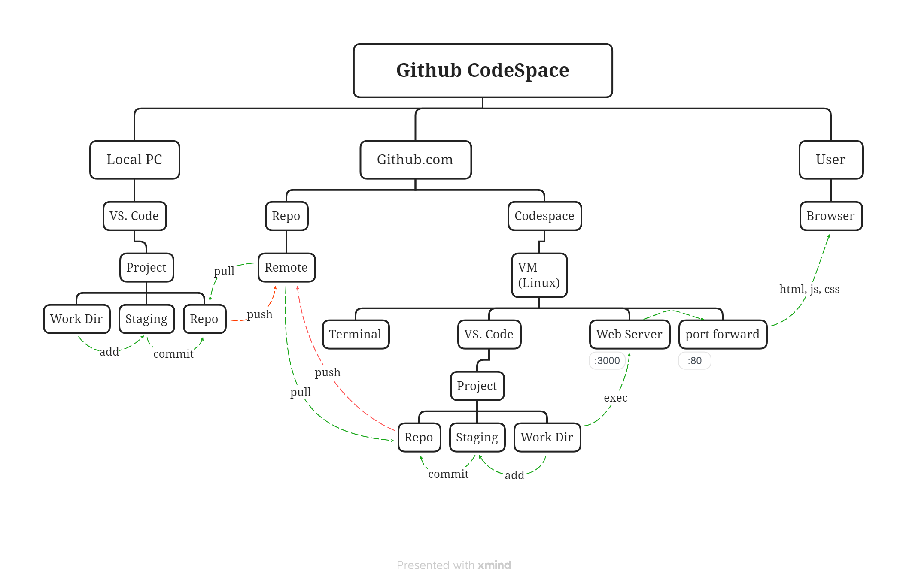

# Cloud Project Development

## GitHub CodeSpace
### FireStore available Sample code
  - C#, Go, Java, Node.js, PHP, Python, Ruby

### Using github.com CodeSpace Development Process
  - Select Server program from FireStore available sample code
  - Write sample Server/Front project, create a repo in github
  - Create a CodeSpace from Repo
  - Code change in the CodeSpace 
  - Commit code & Push
  - github.com dev diagram
  - 

## Google Cloud Run Deployment Process
  - [Getting started with Node.js](https://cloud.google.com/nodejs/getting-started#whats-next)
  - Use Google Cloud console and gcloud to load the project
  - Persist your data with Firestore.
  - Store file uploads in Cloud Storage.
  - Deploy your app to Cloud Run.
    - Build docker images and submit to container registry.
    - Deploy cloud run with docker image
  - 
