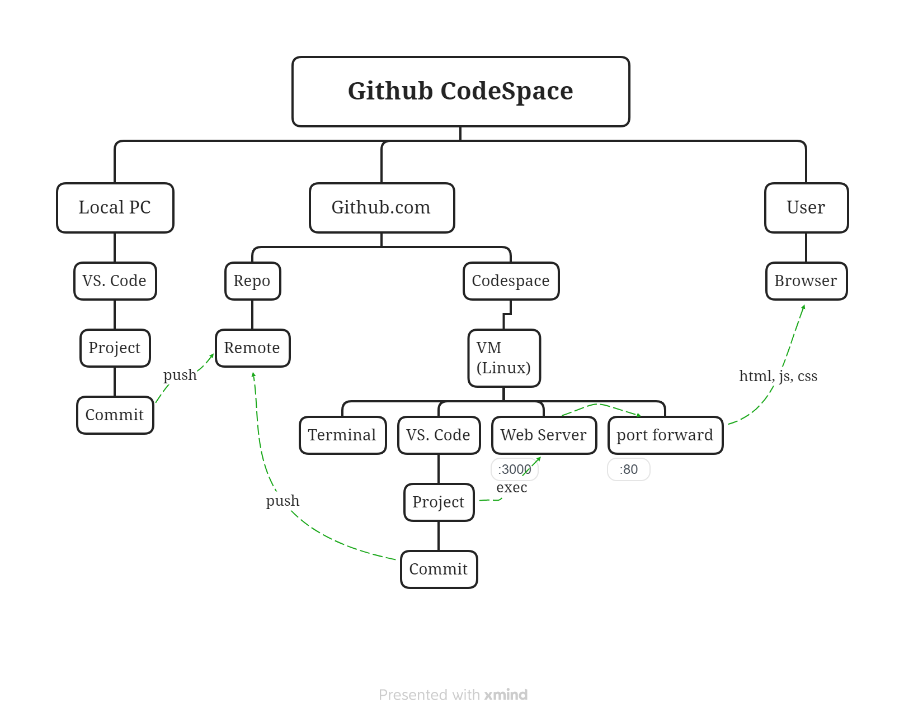

## GitHub CodeSpace
### FireStore available Sample code
  - C#, Go, Java, Node.js, PHP, Python, Ruby

### Using github.com CodeSpace Development Process
  - Select Server program from FireStore available sample code
  - Write sample Server/Front project, create a repo in github
  - Create a CodeSpace from Repo
  - Code change in the CodeSpace 
  - Commit code & Push
  - github.com dev diagram
  - 
